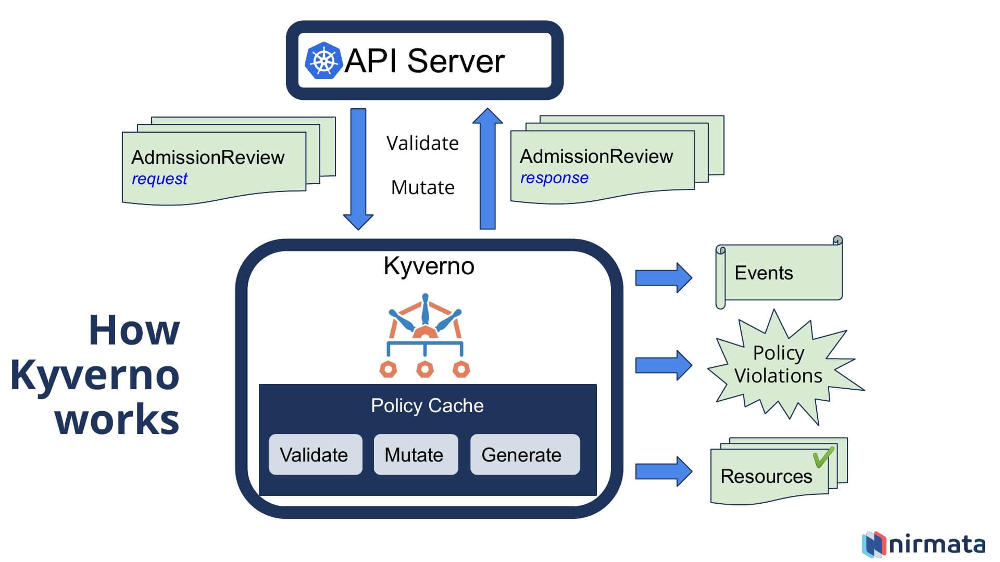

# Kyverno Compliance Essentials

**A Kyverno policy suite enforcing image source restrictions, mandatory deployment labeling, and standardization to ensure compliance across Kubernetes clusters.**

## Table of Contents
- [Kyverno Basic Architecture](#kyverno-basic-architecture)
- [Overview](#overview)
- [Prerequisites](#prerequisites)
- [Installation](#installation)
- [Usage](#usage)
- [Policies Included](#policies-included)
- [Contributing](#contributing)
- [Commands](#commands)

## Kyverno Basic Architecture



**Kyverno’s architecture** involves several key components:
- **Admission Control Webhook**: Enforces policies by intercepting and validating requests to Kubernetes.
- **Mutating Webhook**: Automatically applies default configurations or modifies existing configurations to comply with policies.
- **Validating Webhook**: Ensures that resource configurations meet compliance requirements and alerts on violations.
- **Policy Engine**: Processes defined policies and applies them to target resources across the cluster.
  
This architecture allows Kyverno to manage policies seamlessly across Kubernetes environments, enforcing security, compliance, and operational standards.

## Overview
This repository includes essential Kyverno policies to:
- Restrict image sources to specified repositories.
- Ensure consistent labeling for deployments.
- Enforce standardized deployment practices across Kubernetes clusters.

## Prerequisites

- Ensure your Kubernetes cluster is up and running in Docker or another container runtime.
- Create at least two or three clusters using Minikube or any other Kubernetes service to test the policies across multiple environments.

## Installation

Follow the steps below to install Kyverno and apply policies.

## Usage
After installation, these policies will automatically enforce compliance on relevant Kubernetes resources:
- All images must originate from the specified repository (e.g., `kodekloud`).
- Deployments require a `team` label to meet labeling standards.

To check the status of applied policies, refer to the commands section below.

## Policies Included

1. **Image Repository Policy (`image-repo-policy.yaml`)**  
   Enforces that container images are pulled only from allowed repositories.

2. **Deployment Label Policy (`webapp.yaml`)**  
   Requires a `team` label on deployments for organizational consistency.

3. **kkcolor Deployment Policy (`kkcolor.yaml`)**  
   Example deployment file for testing and demonstration purposes.

## Contributing
Feel free to open issues or submit pull requests for new policies or enhancements.

## Commands
```bash
# Clone the repository and navigate into it
git clone https://github.com/yourusername/kyverno-compliance-essentials.git
cd kyverno-compliance-essentials

# Ensure Kyverno is installed on your Kubernetes cluster
kubectl create -f https://raw.githubusercontent.com/kyverno/kyverno/main/definitions/release/install.yaml

# Apply the policies to your cluster
kubectl apply -f image-repo-policy.yaml
kubectl apply -f webapp.yaml
kubectl apply -f kkcolor.yaml

# To check the status of applied policies
kubectl get cpol
